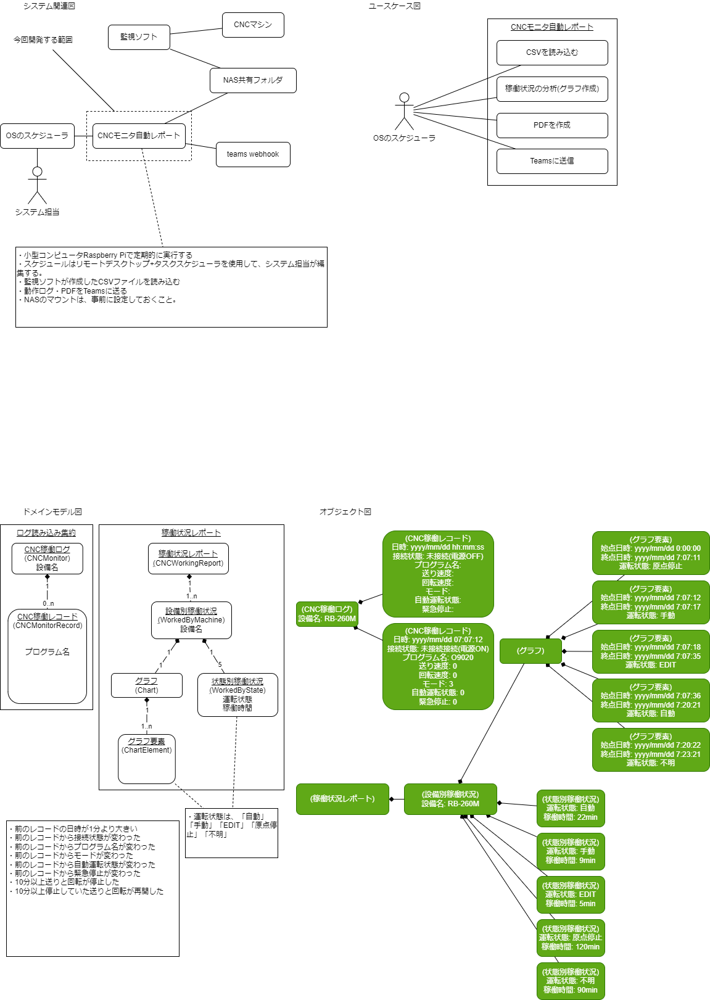

# SynchronizeMono-revoDeliveryDates

## 技術資料



### 規約

[他言語プログラマが最低限、気にすべきGoのネーミングルール](https://zenn.dev/keitakn/articles/go-naming-rules)
[Go の命名規則](https://micnncim.com/posts/ja/go-naming-convention)

### 開発環境インストール

vscodeは入っている前提で説明する。

こちらを参考に、拡張機能をインストールして、設定を行う。
[VSCodeでGo言語の開発環境を構築する](https://qiita.com/melty_go/items/c977ba594efcffc8b567)

さらに読み進めてプロジェクトのセットアップを行う。
もしくは、gitからダウンロードする。

launch.jsonを記述する。

```json
{
    // IntelliSense を使用して利用可能な属性を学べます。
    // 既存の属性の説明をホバーして表示します。
    // 詳細情報は次を確認してください: https://go.microsoft.com/fwlink/?linkid=830387
    "version": "0.2.0",
    "configurations": [
        {
            "name": "Launch Workspace",
            "type": "go",
            "request": "launch",
            "mode": "auto",
            "program": "${workspaceFolder}"
        },
        {
            "name": "Launch File",
            "type": "go",
            "request": "launch",
            "mode": "auto",
            "program": "${fileDirname}"
        }

    ]
}
```

### 必要ライブラリ

#### 環境変数

[【Go】.envファイルをGolangでも使用するためのライブラリ「godotenv」](https://qiita.com/sola-msr/items/fb7d6889d7bd7a6705d0)

```bash
go get -u github.com/joho/godotenv
```

#### ロギング

[golangの高速な構造化ログライブラリ「zap」の使い方](https://qiita.com/emonuh/items/28dbee9bf2fe51d28153)

```bash
go get -u go.uber.org/zap
```

#### ログローテーション

[Go ログ出力&ローテーション](https://qiita.com/KWS_0901/items/c95d11b4d6f271612401)
[Golangの高速なロガーzapとlumberjackでログを出力してrotateさせる](https://www.sambaiz.net/article/104/)

```bash
go get -u gopkg.in/natefinch/lumberjack.v2
```

#### モック

[Goでメソッドを簡単にモック化する【gomock】](https://qiita.com/gold-kou/items/81562f9142323b364a60)
参考:[Goのテストに使える手作りモックパターン](https://moneyforward.com/engineers_blog/2021/03/08/go-test-mock/#fnref:1)

```bash
go get github.com/golang/mock/gomock
go install github.com/golang/mock/mockgen
```

#### sqlモック

[Goでデータベースを簡単にモック化する【sqlmock】](https://qiita.com/gold-kou/items/cb174690397f651e2d7f)

```bash
go get github.com/DATA-DOG/go-sqlmock
```

#### エンコード

[Re: Goでcsvを操作するための基本的な知識](https://zenn.dev/mattn/articles/fd545a14b0ffdf)

```bash
go get golang.org/x/text/encoding/japanese golang.org/x/text/transform
```
